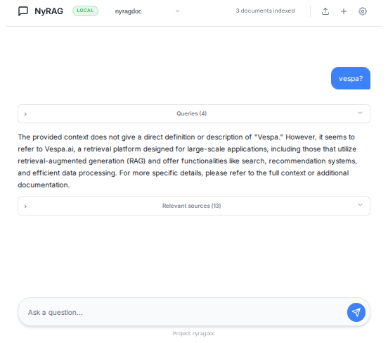

# Vespa RAG Blueprint with NyRAG

Build a production-ready RAG (Retrieval-Augmented Generation) application in minutes using Vespa Cloud and NyRAG.



## What is This?

This repository contains a complete, working example of a RAG application that combines:

- **Vespa RAG Blueprint**: Pre-configured Vespa application with hybrid search (BM25 + vector search)
- **Modified NyRAG**: Document processing tool that handles chunking, embeddings, and chat UI
- **Ready-to-use scripts**: Quick start scripts for cloud deployments

**What you can do:**
- Process PDFs, DOCX, websites, and other documents
- Search your data using hybrid search (semantic + keyword)
- Chat with your documents using LLM-powered answers
- Deploy to production with Vespa Cloud (billions of docs, thousands of queries/sec)

## Quick Start (Cloud)

### Prerequisites

- [Vespa Cloud account](https://console.vespa-cloud.com/) (free trial available)
- Python 3.10+
- [uv](https://docs.astral.sh/uv/) (recommended) or pip

### 1. Deploy to Vespa Cloud

1. Go to [Vespa Cloud Console](https://console.vespa-cloud.com/)
2. Deploy the **RAG Blueprint** sample application
3. Save your **endpoint URL** and **token**

### 2. Install

```bash
git clone https://github.com/vespauniversity/vespa-ragblueprint
cd vespa-ragblueprint

# Install using uv (recommended)
uv sync
source .venv/bin/activate

# Or using pip
pip install -e .
```

### 3. Configure

Create or edit `doc_example.yml`:

```yaml
name: doc
mode: docs
deploy_mode: cloud
start_loc: /path/to/your/documents/

# Use the RAG Blueprint schema
vespa_app_path: ./vespa_cloud

# Your Vespa Cloud credentials
vespa_cloud:
  endpoint: https://your-app.vespa-cloud.com
  token: vespa_cloud_YOUR_TOKEN_HERE

# Document settings
doc_params:
  recursive: true
  file_extensions:
    - .pdf
    - .docx
    - .txt
    - .md

# LLM configuration (optional)
llm_config:
  base_url: https://openrouter.ai/api/v1
  model: meta-llama/llama-3.2-3b-instruct:free
  api_key: your-api-key
```

### 4. Run

**Quick start (recommended):**
```bash
./run_nyrag.sh
```

This script automatically:
- Checks your Vespa Cloud connection
- Loads your token from `doc_example.yml`
- Sets up environment variables
- Starts NyRAG UI on http://localhost:8000

**Or manually:**
```bash
export VESPA_CLOUD_SECRET_TOKEN='your-token'
nyrag ui --cloud
```

### 5. Process Documents & Chat

1. Open http://localhost:8000
2. Upload your documents or configure a website to crawl
3. Monitor processing progress
4. Start chatting with your data!

## How to Get Free LLM API Keys

### Option 1: OpenRouter
- Sign up at [openrouter.ai](https://openrouter.ai/)
- 100+ models available
- Use model: `meta-llama/llama-3.2-3b-instruct:free`

### Option 2: OpenAI
- Sign up at [platform.openai.com](https://platform.openai.com/)
- Use model: `gpt-4o-mini`

### Option 3: Groq
- Sign up at [console.groq.com](https://console.groq.com/)
- Use model: `llama-3.3-70b-versatile`

### Option 4: Ollama (100% Free - Local)
- Download from [ollama.com](https://ollama.com/)
- Runs locally, no API key needed
- Setup:
  ```bash
  ollama pull llama3.2
  ollama serve
  ```
- Config:
  ```yaml
  llm_config:
    base_url: http://localhost:11434/v1
    model: llama3.2
    api_key: dummy
  ```

## Project Structure

```
vespa-ragblueprint/
├── vespa_cloud/          # Vespa Cloud application package
│   ├── services.xml      # Vespa services configuration
│   ├── schemas/          # Document schema (doc.sd) and rank profiles
│   ├── models/           # Models files
│   └── search/           # Query profiles
├── config/               # Vespa Cloud application package
│   ├── doc_example.yml   # Example configuration file
│   └── web_example.yml   # Example config for website crawling
├── src/nyrag/            # NyRAG source code
├── dataset/              # Example documents (PDFs, DOCX)
├── run_nyrag.sh          # Quick start NyRAG
├── stop_nyrag.sh         # Stop NyRAG
├── process_docs.sh       # Process document files
└── README.md             # This file
```

## How It Works

### Architecture

```
Documents (PDFs, websites, etc.)
    ↓
NyRAG (processing)
    ├─ Chunking (1024 chars)
    ├─ Embedding generation (sentence-transformers)
    └─ Feed to Vespa
        ↓
Vespa (storage & search)
    ├─ Hybrid search (BM25 + vector)
    ├─ Binary quantization (10x smaller)
    └─ Scalable (billions of docs)
        ↓
NyRAG (answer generation)
    ├─ Multi-query retrieval
    ├─ Chunk fusion
    └─ LLM answer generation
        ↓
User (chat interface)
```

### Key Features

**Hybrid Search:**
- **BM25**: Exact keyword matching for precision
- **Vector Search**: Semantic similarity for recall
- **Combined**: Best of both worlds

**Binary Quantization:**
- Reduces embeddings from 768 floats to 96 int8 values
- 10x storage reduction
- Minimal quality loss
- Uses Hamming distance for fast search

**Multi-Query RAG:**
- Generates multiple search queries from user question
- Retrieves chunks from each query
- Ranks and deduplicates results
- LLM generates answer from top chunks

## Configuration Options

### Document Mode

Process local files:

```yaml
name: doc
mode: docs
start_loc: /path/to/documents/
doc_params:
  recursive: true
  include_hidden: false
  follow_symlinks: false
  max_file_size_mb: 100
  file_extensions:
    - .pdf
    - .docx
    - .txt
    - .md
    - .html
```

### Web Crawling Mode

Crawl websites:

```yaml
name: web
mode: web
start_loc: https://example.com/
crawl_params:
  respect_robots_txt: true
  aggressive_crawl: false
  follow_subdomains: true
  strict_mode: false
  allowed_domains:
    - example.com
    - docs.example.com
```

## Querying Your Data

### Via NyRAG UI

Use the web interface at http://localhost:8000 - it's the easiest way!

### Via Python

```python
from vespa.application import Vespa

# Connect to Vespa Cloud
app = Vespa(
    url="https://your-app.vespa-cloud.com",
    vespa_cloud_secret_token="your-token"
)

# Hybrid search
response = app.query(
    yql="select * from doc where userQuery()",
    query="What is RAG?",
    hits=5
)

for hit in response.hits:
    print(f"Title: {hit['fields']['title']}")
    print(f"Chunks: {hit['fields']['chunks'][:2]}")
```

### Via Vespa CLI

```bash
# Go to vespa cloud application directory
cd vespa_cloud

vespa config set target cloud
vespa config set application your-tenant.your-app
vespa auth login

vespa query 'query=What is RAG?'
```

## Advanced: The Schema

The RAG Blueprint uses this schema (`vespa_cloud/schemas/doc.sd`):

```java
schema doc {
    document doc {
        field id type string { ... }
        field title type string {
            indexing: index | summary
            index: enable-bm25
        }
        field text type string { }
    }

    # Binary quantized title embeddings
    field title_embedding type tensor<int8>(x[96]) {
        indexing: input title | embed | pack_bits | attribute | index
        attribute { distance-metric: hamming }
    }

    # Text chunks (1024 chars each)
    field chunks type array<string> {
        indexing: input text | chunk fixed-length 1024 | summary | index
        index: enable-bm25
    }

    # Binary quantized chunk embeddings
    field chunk_embeddings type tensor<int8>(chunk{}, x[96]) {
        indexing: input text | chunk fixed-length 1024 | embed | pack_bits | attribute | index
        attribute { distance-metric: hamming }
    }
}
```

**Key Points:**
- Embeddings are binary quantized (768 → 96 dimensions)
- Chunking happens automatically in Vespa
- Both BM25 and vector search enabled
- Hamming distance for fast binary vector search

## Scripts

### `run_nyrag.sh`

Quick start for Vespa Cloud:
- Checks Vespa Cloud connection
- Loads token from `doc_example.yml`
- Starts NyRAG UI
### `process_docs.sh`

Batch process documents without UI:
- Reads config from `doc_example.yml`
- Processes all documents
- Feeds to Vespa Cloud

## Troubleshooting

### "Cannot connect to Vespa Cloud"

Check:
1. Is your Vespa Cloud app deployed?
2. Is the endpoint URL correct?
3. Is the token valid?
4. Run `vespa status` to verify connection

### "Virtual environment not found"

Run:
```bash
uv sync
source .venv/bin/activate
```

### "Out of memory" (local Docker)

Vespa requires 8-12GB RAM. Check Docker settings:
```bash
docker stats
```

### Embeddings not working

Make sure you're using the modified NyRAG from this repo, not `pip install nyrag`.

## Learn More

**Tutorials:**
- [Step-by-step blog post](blog/README.md) - Complete beginner tutorial
- [Vespa RAG Blueprint Tutorial](https://docs.vespa.ai/en/tutorials/rag-blueprint.html) - Official docs

**Resources:**
- [Vespa Documentation](https://docs.vespa.ai/)
- [Vespa Cloud Console](https://console.vespa-cloud.com/)
- [Original NyRAG Repository](https://github.com/vespaai-playground/NyRAG)
- [Vespa Slack](http://slack.vespa.ai/) - Get help

## Contributing

This is a reference implementation for educational purposes. Feel free to fork and modify for your use case!

## License

See [LICENSE](LICENSE) file.

## Credits

- **Vespa**: Scalable search engine by [vespa.ai](https://vespa.ai/)
- **NyRAG**: Document processing tool by [Abhishek Thakur](https://github.com/abhishekkrthakur)
- **RAG Blueprint**: Based on Vespa's official RAG Blueprint sample app

---

**Questions?** Join the [Vespa Slack](http://slack.vespa.ai/) or open an issue!
