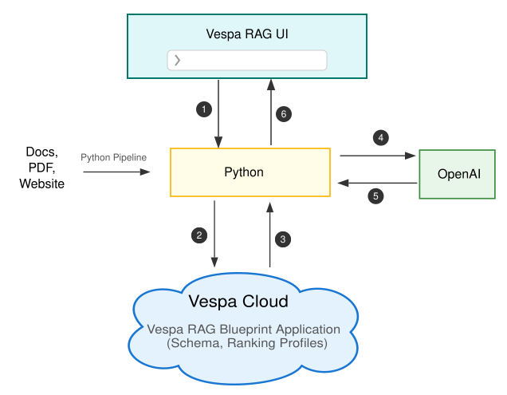

# Build a High-Quality RAG App on Vespa Cloud in 15 Minutes

*From Zero to RAG: A Step-by-Step Tutorial*

**Retrieval-Augmented Generation (RAG)** allows an LLM to answer questions using your data at query time.

On their own, LLMs are powerful but limited: they can hallucinate, they have a fixed knowledge cutoff, and they know nothing about your private documents, internal wikis, or proprietary systems.

RAG bridges that gap by retrieving relevant information from your data and supplying it to the model as context, so responses are grounded in real, trusted sources rather than guesswork.

## The Challenge: The Quality of the Context Window

In Retrieval-Augmented Generation (RAG), the real bottleneck is the LLM’s context window. You can’t simply pass your entire dataset into a prompt—there’s a strict token budget.

Because of this, the problem isn’t just retrieving information, but retrieving the right information. When the context window is filled with loosely matched or low-quality results, the LLM has little to work with and the quality of its answers drops accordingly.

High-quality RAG depends on semantic understanding, precise retrieval, and strong ranking across diverse data types so that every token in the context window earns its place.


## The Solution: Out-of-the-Box RAG on Vespa Cloud

Vespa Cloud provides an out-of-the-box Vespa RAG Blueprint designed to maximize the quality of the context sent to the LLM. Instead of relying solely on nearest-neighbor vector search, Vespa combines semantic vector retrieval with lexical BM25 matching and applies advanced ranking, using models such as BERT, LightGBM, or custom logic—to ensure that only the strongest candidates are selected.

This hybrid retrieval and ranking approach consistently surfaces the most relevant document chunks, which significantly improves the quality of the final generated answer.

In this blog post, we’ll build a complete Retrieval-Augmented Generation (RAG) application from end to end by leveraging the OOTB Vespa RAG app on Vespa cloud. The following diagram shows the architecture we’ll be working with:



The architecture consists of two main flows: data ingestion and query processing.

**Data Ingestion (one-time setup)**

First, we ingest our data sources, such as documents, PDFs, or web pages by using a Python-based pipeline. The pipeline processes the data, splits it into manageable chunks, generates embeddings, and feeds everything into a Vespa Cloud RAG application that is preconfigured with a schema and ranking profiles. This step populates the search index.

**Query Flow (live interaction)**

1. A user enters a question in the **Vespa RAG UI**.

2. The UI sends the query to a **Python backend**, which issues a hybrid search request (combining keyword and vector retrieval) to **Vespa Cloud**.

3. **Vespa Cloud** returns the most relevant document chunks.

4. The backend sends those chunks, along with the original query, to a **LLM** as context.

5. The model generates an answer grounded in that context and returns it to the backend.

6. The backend streams the answer back to the UI.

This architecture ensures that generated responses are grounded in your own data, combining Vespa’s retrieval and ranking strengths with the generative capabilities of large language models.

The end-to-end setup takes about 15 minutes, plus additional time to process your documents.

---

## Deploy Vespa RAG Blueprint to Vespa Cloud

We’ll start by deploying a preconfigured RAG Blueprint to Vespa Cloud. This gives you a high-quality retrieval stack in minutes, and it’s free to get started. All of this is done directly from the Vespa Cloud console.

**Sign up for Vespa Cloud**

Go to the [Vespa Cloud Console](https://console.vespa-cloud.com/) and create an account. If this is your first time using Vespa Cloud, the free trial is the fastest way to get going.


**Deploy RAG Blueprint**

In the console, select **"Deploy your first application"**.


Choose **"Select a sample application to deploy directly from the browser"**.


Select **"RAG Blueprint"**.


Click **"Deploy"** and wait for the deployment to complete.


**Save your credentials**

Once deployment finishes, the console will generate an access token. **Save this immediately.**


That token is how Python backend authenticates with Vespa Cloud. Treat it like a password.

Continue through the remaining setup screens, then open the application view.


**Note your endpoint URL**

In the application view you will also find the endpoint URL. It typically looks like `https://[app-id].vespa-cloud.com`. Save both the **endpoint URL** and the token; you will need them to configure Python backend in the next section.

## Behind the Scenes: What You Just Deployed

When you clicked **Deploy**, Vespa Cloud automatically provisioned infrastructure and deployed a complete **Vespa application package**. This package includes everything needed for a high-quality RAG system: schemas, indexing logic, ranking profiles, and service configuration.

In other words, you didn’t just spin up a demo, you launched a ready-to-use, high-quality retrieval engine.

Let’s take a closer look at what’s inside.

### The Schema

The RAG Blueprint uses a carefully designed schema that controls how documents are stored, chunked, embedded, and retrieved:

`vespa_cloud/schemas/doc.sd`:

```java
schema doc {
    document doc {
        field id type string {
            indexing: summary | attribute
        }
        field title type string {
            indexing: index | summary
            index: enable-bm25
        }
        field text type string {
        }

        # Optional metadata fields for tracking document usage
        field created_timestamp type long {
            indexing: attribute | summary
        }
        field modified_timestamp type long {
            indexing: attribute | summary
        }
        field last_opened_timestamp type long {
            indexing: attribute | summary
        }
        field open_count type int {
            indexing: attribute | summary
        }
        field favorite type bool {
            indexing: attribute | summary
        }
    }

    # Binary quantized embeddings for the title (768 floats → 96 int8)
    field title_embedding type tensor<int8>(x[96]) {
        indexing: input title | embed | pack_bits | attribute | index
        attribute {
            distance-metric: hamming
        }
    }

    # Automatically chunks text into 1024-character segments
    field chunks type array<string> {
        indexing: input text | chunk fixed-length 1024 | summary | index
        index: enable-bm25
    }

    # Binary quantized embeddings for each chunk
    field chunk_embeddings type tensor<int8>(chunk{}, x[96]) {
        indexing: input text | chunk fixed-length 1024 | embed | pack_bits | attribute | index
        attribute {
            distance-metric: hamming
        }
    }

    fieldset default {
        fields: title, chunks
    }

    document-summary top_3_chunks {
        from-disk
        summary chunks_top3 {
            source: chunks
            select-elements-by: top_3_chunk_sim_scores
        }
    }
}
```

**What's happening here:** Your documents store their raw content in `title` and `text`. During indexing, the `text` field automatically split into 1024-character chunks. Embeddings are generated for both titles and chunks, then binary-quantized using `pack_bits`, shrinking 768 floating-point values down to just 96 `int8`s. This dramatically reduces storage and improves performance while still supporting efficient vector similarity search.

At the same time, BM25 is enabled for lexical matching. This combination is what enables Vespa’s hybrid retrieval: semantic matching plus exact term relevance.


**Out-of-the-Box Ranking Profiles:**

The RAG Blueprint ships with six ranking profiles, covering a range of speed-versus-quality trade-offs:

1. **base-features** (default, fast)
   Blends BM25 text matching with vector similarity. This is the best place to start and a solid everyday choice when you want fast responses with good relevance.

2. **learned-linear** (lightweight learned model).
   Adds a simple logistic regression model on top of the base features. It offers a quality boost without the cost of heavier second-phase ranking.
   
3. **second-with-gbdt** (highest quality)
   Uses a LightGBM model in a second ranking phase. This profile typically delivers the best results on complex queries, at the cost of additional latency.

4. **match-only** (no ranking, fastest).
   Primarily useful for debugging. It confirms that retrieval works without applying ranking logic.
   
5. **collect-training-data** and 6. **collect-second-phase** (training workflows)
   Designed for advanced setups where you collect signals to train or tune custom ranking models.

> **For Advanced Users:** Want to understand the technical details behind these ranking profiles? Learn about phased ranking architecture, LightGBM model integration, tensor operations, and how Vespa scales ranking to billions of documents. See the comprehensive [Ranking Profiles technical guide](https://github.com/vespauniversity/vespa-ragblueprint#ranking-profiles) in the main README, including GitHub folder structure (`vespa_cloud/schemas/doc/*.profile`) and profile inheritance.

**Which profile should you use?**  
Start with `base-features` for fast, solid results. Switch to `second-with-gbdt` when relevance really matters. It can make a noticeable difference on harder questions. And when debugging retrieval, `match-only` is the quickest way to verify that documents are being matched at all.

---

Now that your RAG Blueprint Vespa Cloud application is up and running, it’s time to add the missing pieces: a simple frontend UI and a data ingestion pipeline. For this, we’ll use **NyRAG**, a tool included in the [`vespa-ragblueprint`](https://github.com/vespauniversity/vespa-ragblueprint) repository.

NyRAG acts as the glue for the entire RAG workflow. It reads documents from local files or websites, splits text into manageable chunks, generates embeddings, feeds everything into Vespa, and finally exposes a lightweight chat UI where you can ask questions over your data. Instead of wiring all of this together yourself, NyRAG gives you a working end-to-end system out of the box.

### Install NyRAG

```bash
# Clone the repository
git clone https://github.com/vespauniversity/vespa-ragblueprint
cd vespa-ragblueprint

# Install uv (Fast, modern Python package manager)
# macOS
brew install uv

# Linux & macOS
# curl -LsSf https://astral.sh/uv/install.sh | sh
# Windows (PowerShell)
# powershell -ExecutionPolicy ByPass -c "irm https://astral.sh/uv/install.ps1 | iex"

# Verify uv installation
uv --version

# Install dependencies using uv
uv sync
source .venv/bin/activate

# Windows (PowerShell)
# powershell -ExecutionPolicy Bypass
# . .\.venv\Scripts\activate

# Install nyrag locally
uv pip install -e .

# Verify nyrag installation
nyrag --help
```


**Get an LLM API key**

To generate final answers, NyRAG needs an OpenAI-compatible API key. The simplest way to get started is **OpenRouter**, which provides access to multiple LLMs through a single API.

In this walkthrough, we’ll use OpenRouter for convenience. In a real application, you’re free to swap in any compatible LLM provider. To continue, sign up for OpenRouter and generate an API key. You’ll use it in the next step when configuring NyRAG.

---

### Start the NyRAG UI

```bash
# This script handles all configuration automatically
./run_nyrag.sh

# Windows (PowerShell)
# powershell -ExecutionPolicy Bypass
# .\run_nyrag.ps1
```

The `run_nyrag.sh` script starts the UI and wires up the configuration so NyRAG can talk to Vespa Cloud. In practice, it loads your project config, uses the token you provide for authentication, and starts the web UI on port 8000.


Open http://localhost:8000 in your browser.

**Configure your project:**
Now you'll configure your project using the web UI to connect to your Vespa Cloud deployment and set up document processing.

**Step 1: Select and edit the example project**

In the top header, the project dropdown shows **"doc_example"**. If you are starting from the example config, it is usually pre-selected. The configuration editor typically opens automatically; if it does not (for example you land directly in chat), open the three-dot menu (⋮) and choose **"Edit Config"**.


**Description**: Shows the project dropdown menu in the header with "doc_example" option

> **Note:** If the configuration editor doesn't appear (shows chat interface instead), click the **three-dot menu** (⋮) in the top right corner and select **"Edit Config"** to open it manually.

**Step 2: Update your credentials**

In the configuration editor, paste in the information you saved from Vespa Cloud and your LLM provider. You only need three things to get going: your Vespa tenant name, your Vespa endpoint + token, and your LLM API key.

**Required fields to update:**

```yaml
# Your Vespa Cloud credentials (from Vespa Cloud Console)
cloud_tenant: your-tenant          # Your Vespa Cloud tenant name
vespa_cloud:
  endpoint: https://your-app.vespa-cloud.com  # Your Vespa token endpoint (not mtls)
  token: vespa_cloud_YOUR_TOKEN_HERE          # Your Vespa data plane token

# Your LLM configuration (default: OpenRouter)
llm_config:
  api_key: sk-or-v1-YOUR_KEY_HERE   # Your OpenRouter API key (or other provider)
```

**Notes:**

The default LLM provider is OpenRouter. If you switch providers, also update `base_url` and `model` to match. For the included example documents, `start_loc` defaults to `./dataset`, so you can run the pipeline without changing anything else.

**Step 3: Save and start processing**

After updating the configuration, you can close the editor (changes are saved automatically) and start indexing. If you are using the example dataset, keep `./dataset` as-is; otherwise, point `start_loc` at the folder (or site) you want to ingest. When you click **"Start Indexing"**, NyRAG reads your input, chunks it into 1024-character segments, generates embeddings, feeds everything to Vespa Cloud, and shows progress in the terminal panel so you can see exactly what is happening.


**Description**: Shows documents being processed with terminal logs displaying progress  

---

## Chat with Your Data

You can now start asking questions in the chat UI.


When you submit a query, NyRAG expands it into focused retrieval queries and sends them to Vespa. Vespa runs hybrid retrieval, combining BM25 keyword matching with vector similarity, and returns the most relevant chunks. Those chunks are packed into a compact context window and sent to the LLM, which generates an answer grounded entirely in your data.

A good way to sanity-check the setup is to start with a broad question like “What are the main topics in these documents?” and then follow up with something more specific to confirm the retrieved context makes sense.

At this point, you have a fully functional RAG application running on Vespa Cloud.

### Improving Search Quality with Ranking Profiles

Want better search results? You can fine-tune how Vespa ranks your documents using the Settings modal (⚙️ icon in the top right).

**Change ranking profiles:** Open the ⚙️ **Settings** panel, choose a **Ranking Profile** from the dropdown, and click **"Save"**. The very next query you run will use the new profile.

  
**Description**: Settings modal showing ranking profile selection dropdown with 6 available options

**Pro tip**: The quality difference between `base-features` and `second-with-gbdt` can be dramatic for complex queries. Try both and see which works best for your use case!

---


### Managing Your Data

NyRAG also gives you simple tools for cleanup. Open the advanced menu (three-dot icon ⋮ in the top right) and you will find two cleanup actions. **Clear Local Cache** removes cached files for all projects on your machine, which is useful when you want to re-process from scratch locally. **Clear Vespa Data** deletes the indexed documents in Vespa for the project, which is useful when you want a clean index before re-feeding. Both actions ask for confirmation so you do not delete data by accident.

---

## Bonus: Try Web Crawling Mode

In addition to local documents, NyRAG supports web crawling. By switching to the web_example project, you can point NyRAG at a website and have it crawl, extract, and index content automatically.

**Switch to web crawling mode:**  Select `web_example (web)` from the dropdown at the top and open the configuration editor. If you are currently on the chat screen, open the three-dot menu (⋮) and choose **"Edit Config"** to bring the editor back. From there, update the same credential fields as you did for `doc_example`, then click **"Start Indexing"** to crawl and feed the site.

 
**Description**: Shows web crawling in progress with terminal logs displaying discovered URLs and processed pages

**Web Mode Features:** Web mode discovers and follows links automatically, while still respecting `robots.txt` and crawl delays so you do not hammer a site. It also does smart content extraction to drop navigation and boilerplate, deduplicates very similar pages, and supports resume so you can continue a crawl after interruption.

**Example Use Cases:** Web mode is a good fit for product documentation, knowledge bases, blog archives, help-center content, and technical wikis. In general, it works best on sites with consistent HTML structure and clean, text-heavy pages.

**Tips:** Start small. Crawl a limited part of a site first so you can sanity-check what gets extracted and indexed, then expand. Use `exclude` patterns to skip sections you do not want (for example `/pricing` or `/sales/*`), and keep an eye on the terminal output panel so you can spot loops, unexpected URLs, or pages that fail to parse.


---

## Troubleshooting

Running into issues? We've got you covered! For detailed troubleshooting guides covering Vespa connection errors, LLM configuration, document processing, and more, see the **[Troubleshooting section](https://github.com/vespauniversity/vespa-ragblueprint#troubleshooting)** in the main README.

**Quick help:** If you get stuck, the fastest path is usually to ask in the [Vespa Slack](http://slack.vespa.ai/) community, where people can help you interpret logs and query behavior. If you think you found a bug or want to request an improvement, open an issue in [GitHub Issues](https://github.com/vespauniversity/vespa-ragblueprint/issues). And when you want deeper background on schema, ranking, and deployment, the [Vespa Docs](https://docs.vespa.ai/) are your go-to reference.

---

## Conclusion

**Congratulations!** You now have a working RAG app: a Vespa Cloud deployment that can retrieve high-quality context, and a small UI that lets you ingest data and chat with it.

Building a high-quality RAG system is never trivial. There are multiple moving parts to get right: the quality of the LLM, the size and management of its context window, and how effectively your retrieval system surfaces the most relevant information.

Thanks to the out-of-the-box Vespa RAG blueprint on Vespa Cloud, much of this complexity is handled for you. It comes with multiple ranking profiles, and its default hybrid retrieval setup combines **vector similarity with BM25 text matching**, ensuring your LLM sees the best possible context for every query. 

Vespa Cloud doesn’t just make building RAG easier, it makes it **scalable, fast, and reliable**, giving you production-ready infrastructure, auto-scaling and observability without the headaches of self-hosting. Whether you’re experimenting with small datasets or scaling to millions of documents, Vespa Cloud provides the tools and flexibility to make your RAG project shine.

Want to dive deeper? Start with the [RAG Blueprint Tutorial](https://docs.vespa.ai/en/learn/tutorials/rag-blueprint.html) for a thorough conceptual walkthrough. And remember the [Vespa Slack community](https://vespatalk.slack.com/) is always there to help. Ask questions, share what you’ve built, or get advice on retrieval, ranking, and deployment strategies.

Ready to experience the power of Vespa Cloud for yourself? [Sign up](https://cloud.vespa.ai/) today and **start building high-quality RAG applications with ease**!


