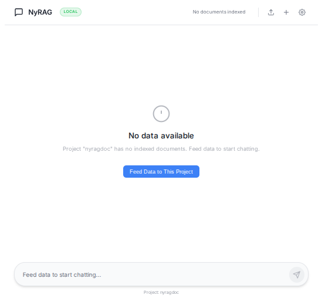
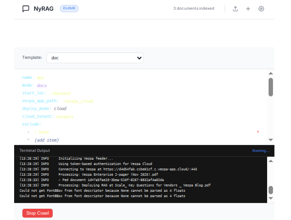
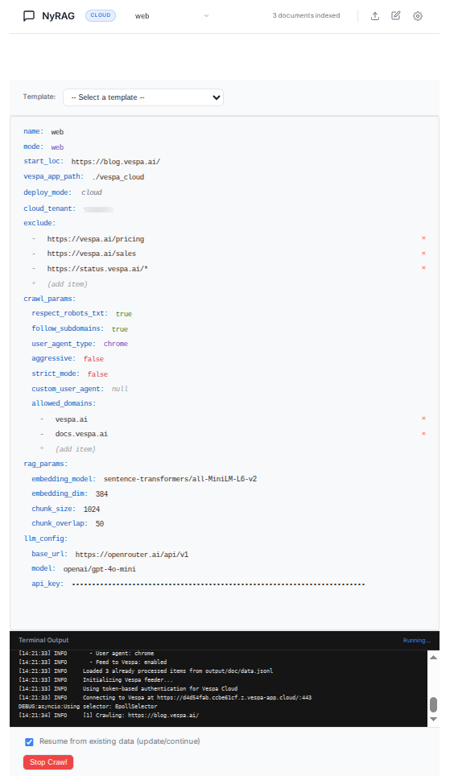

# Build a High-Quality RAG App on Vespa Cloud in 15 Minutes

*From Zero to RAG: A Simple Step-by-Step Tutorial*


In this tutorial, you'll build a complete RAG (Retrieval-Augmented Generation) application in just 4 steps:

**What you'll build:**
- A scalable search engine powered by Vespa Cloud
- Automatic document processing (PDFs, websites, DOCX, etc.)
- A chat interface to ask questions about your data
- LLM-powered answers grounded in your documents

**What you'll use:**
- **Vespa RAG Blueprint**: Pre-configured Vespa application with hybrid search
- **Modified NyRAG**: Handles document processing, embeddings, and chat UI
- **Your documents**: PDFs, websites, or any text content

**Time required:** ~15 minutes (excluding data processing time)

**The 4-Step Process:**
```
1. Deploy Vespa       →  2. Install NyRAG    →  3. Process Docs    →  4. Chat!
   (via Cloud UI)        (from GitHub)          (PDFs, websites)      (Ask questions)
```

## What is RAG?

Retrieval-Augmented Generation (RAG) is the architecture defined by giving an LLM (Large Language Model) access to your private data. While LLMs like GPT-4 are incredibly powerful, they have significant limitations:
*   **Hallucinations**: They can confidently invent facts.
*   **Knowledge Cutoff**: They don't know about events after their training data cut-off.
*   **Private Data**: They absolutely do not know about your company's internal documents, emails, or databases.

RAG bridges this gap by retrieving relevant information from your data and feeding it to the LLM as "context" to answer a user's question grounded in truth.

## The Challenge: Quality Context Window

The limiting factor in RAG is often the **context window** of the LLM. You can't just feed your entire database into a prompt. You have a finite budget of tokens.
The challenge, therefore, is not just *finding* data, but finding the *most relevant* data. If you fill the context window with low-quality, keyword-matched search results, the LLM will produce low-quality answers. You need semantic understanding, precision, and the ability to rank diverse data types.


## The Solution: Vespa Out-of-the-Box RAG on Vespa Cloud

Vespa Cloud provides an Out-of-the-Box solution that maximizes the quality of your context window. Unlike simple vector databases that only do nearest-neighbor search, Vespa combines:
1.  **Vector Search** (for semantic understanding)
2.  **Lexical Search / BM25** (for exact keyword matching)
3.  **Advanced Ranking** (BERT, LightGBM, or custom logic to score relevance)

This "Hybrid Search" ensures that the documents sent to the LLM are the absolute best matches for the query, drastically improving the final generated answer.

---

## Step 1: Deploy Vespa RAG Blueprint to Vespa Cloud

First, deploy the pre-configured RAG Blueprint to Vespa Cloud (it's free to start!):

**1.1 Sign up for Vespa Cloud:**
- Go to [Vespa Cloud Console](https://console.vespa-cloud.com/)
- Create a free account ([Free trial available](https://vespa.ai/free-trial/))


**1.2 Deploy RAG Blueprint:**

- Select "Deploy your first application"
  

- Select "Select a sample application to deploy directly from the browser"
  

- Select "RAG Blueprint"
  

- Click "Deploy"
  
  

**1.3 Save your credentials:**

- **IMPORTANT:** Save the **token** that appears - you'll need it for authentication!
  

  This token allows secure access to your Vespa deployment. Keep it safe!

- Click "Continue" through the setup
  
  

- Go to application view
  
  
  

**1.4 Note your endpoint URL:**

Your Vespa endpoint will look like: `https://[app-id].vespa-cloud.com`

You can find it in the application view.

**Save these two values:**
- **Endpoint URL**: `https://[app-id].vespa-cloud.com`
- **Token**: `vespa_cloud_...` (for authentication)

You'll use both in Step 3 to connect NyRAG to Vespa, and optionally for direct querying.

---

## Step 2: Install Modified NyRAG


Now install the modified NyRAG tool from the vespa-ragblueprint repository:

```bash
# Clone the repository
git clone https://github.com/vespauniversity/vespa-ragblueprint
cd vespa-ragblueprint

# Install vespa cli if missing

# macOS
brew install vespa-cli

# Or Linux, macOS, Windows
# Download binary from GitHub releases
# Visit: https://github.com/vespa-engine/vespa/releases
# Place the extracted binary in an executable path directory so it can be called from anywhere

# Verify vespa installation
vespa version

# Install uv (Fast, modern Python package manager)

# macOS
brew install uv

# Linux & macOS
# curl -LsSf https://astral.sh/uv/install.sh | sh

# Windows (PowerShell)
# powershell -ExecutionPolicy ByPass -c "irm https://astral.sh/uv/install.ps1 | iex"

# Verify uv installation
uv --version

# Install dependencies using uv
uv sync
source .venv/bin/activate

# Install nyrag localy
uv pip install -e .

# Verify nyrag installation
nyrag --help
```

**What is NyRAG?**
NyRAG is a simple tool that handles:
- Reading your documents (PDFs, DOCX, websites, etc.)
- Chunking text into manageable pieces
- Generating embeddings (converting text to vectors)
- Feeding data to Vespa
- Providing a chat UI with LLM-powered answers

This modified version is optimized to work with the Vespa RAG Blueprint schema.

**Tip:** The repository includes a `run_nyrag.sh` script that makes it easy to start NyRAG with your Vespa Cloud deployment!

---

## Step 3: Configure and Process Your Documents

Update a configuration file to tell NyRAG about your data source and Vespa endpoint:

**3.1 Update `doc_example.yml` file in config directory of the project:**

This file will be used as the configuration for the NyRAG app. You will upload it in the UI in a later step.

**For processing local documents (PDFs, DOCX, etc.):**
```yaml
name: doc
mode: docs
deploy_mode: cloud
start_loc: /path/to/your/documents/

# Use existing Vespa app instead of generating new one
vespa_app_path: /path/to/your/vespa-ragblueprint/vespa_cloud

# Your Vespa Cloud credentials from Step 1
vespa_cloud:
  endpoint: https://your-app.vespa-cloud.com  # Replace with your endpoint
  token: your-vespa-cloud-token               # Replace with your token

# Document processing settings
doc_params:
  recursive: true
  file_extensions:
    - .pdf
    - .docx
    - .txt
    - .md

# LLM configuration (optional - for answer generation)
llm_config:
  base_url: https://openrouter.ai/api/v1
  model: meta-llama/llama-3.2-3b-instruct:free  # Free model
  api_key: your-llm-api-key  # See below for free options
```
Then put your document files in that start_loc directory.

<!--
**For crawling websites:**
```yaml
name: web 
mode: web
deploy_mode: cloud
start_loc: https://example.com/

vespa_cloud:
  endpoint: https://your-app.vespa-cloud.com
  token: your-vespa-cloud-token

crawl_params:
  respect_robots_txt: true
  follow_subdomains: true

llm_config:
  base_url: https://openrouter.ai/api/v1
  model: meta-llama/llama-3.2-3b-instruct:free  # Use free model from above
  api_key: your-llm-api-key
```
-->


**How to get a free LLM API key:**

**Option 1: OpenRouter**
- Sign up at [openrouter.ai](https://openrouter.ai/)
- Access to 100+ models from different providers
- Config:
  ```yaml
  llm_config:
    base_url: https://openrouter.ai/api/v1
    model: meta-llama/llama-3.2-3b-instruct:free  # Free model
    api_key: sk-or-v1-...  # Get from openrouter.ai/keys
  ```

**Option 2: OpenAI**
- Sign up at [platform.openai.com](https://platform.openai.com/)
- Config:
  ```yaml
  llm_config:
    base_url: https://api.openai.com/v1  # Or omit for default
    model: gpt-4o-mini
    api_key: sk-...  # Get from platform.openai.com/api-keys
  ```
<!--
**Option 3: Groq**
- Sign up at [console.groq.com](https://console.groq.com/)
- Free tier with fast inference
- Config:
  ```yaml
  llm_config:
    base_url: https://api.groq.com/openai/v1
    model: llama-3.3-70b-versatile
    api_key: gsk_...  # Get from console.groq.com
  ```

**Option 4: Ollama**
- Download from [ollama.com](https://ollama.com/)
- No API key needed, completely free
- Runs on your computer (requires good CPU/GPU)
- Setup:
  ```bash
  # Install Ollama, then download a model
  ollama pull llama3.2
  ollama serve  # Starts local server
  ```
- Config:
  ```yaml
  llm_config:
    base_url: http://localhost:11434/v1
    model: llama3.2
    api_key: dummy  # Any value works for local
  ```
-->


**Recommendation:** Start with **OpenRouter** (easy, free credits, many models).

---

**3.2 Start the NyRAG UI:**

**Quick way (using the provided script):**
```bash
# This script handles all configuration automatically
./run_nyrag.sh
```

The `run_nyrag.sh` script will:
- Check your Vespa Cloud connection
- Extract the token from your config file
- Set up all environment variables
- Start the NyRAG UI on port 8000


<!--
**Or manually:**
```bash
# Set your token as environment variable
export VESPA_CLOUD_SECRET_TOKEN='your-vespa-cloud-token'

# Start the web interface
nyrag ui --cloud
```
-->

Open http://localhost:8000 in your browser.

**3.3 Process your documents:**

In the NyRAG UI, you can:
- Upload your updated `doc_example.yml` file in config directory of the project)
- Feed data to this project
- Monitor processing progress
- See how many documents are processed

NyRAG will automatically:
1. Read your documents
2. Chunk them into 1024-character segments
3. Generate embeddings for each chunk
4. Feed everything to your Vespa Cloud deployment

  

  

---

## Step 4: Chat with Your Data

Once processing is complete, use the NyRAG chat interface to ask questions!


**How it works:**
1. You type a question
2. NyRAG generates multiple search queries
3. Vespa performs hybrid search (BM25 text + vector similarity)
4. NyRAG ranks and selects the most relevant chunks
5. An LLM generates an answer based only on your documents

**Example queries:**
- "What are the main topics in these documents?"
- "Summarize the key findings"
- "Find information about [specific topic]"

**That's it!** You now have a fully functional RAG application.


---

## Bonus: Try Web Crawling Mode

Want to create a RAG application from website content instead of local documents? NyRAG supports web crawling!

**Quick Start:**
1. Click the **"Edit Project"** button (pencil icon) in the header
2. Change `mode` from `docs` to `web`
3. Set `start_loc` to a website URL (e.g., `https://docs.vespa.ai/`)
4. Configure crawl settings:
   - `respect_robots_txt`: Follow robots.txt rules (recommended: `true`)
   - `follow_subdomains`: Crawl subdomains (e.g., `blog.vespa.ai`)
   - `exclude`: List of URL patterns to skip (e.g., `/pricing`, `/sales/*`)
5. Check **"Resume from existing data"** if updating an existing crawl
6. Click **"Start Crawl Process"**

**Web Mode Features:**
- Automatic link discovery and crawling
- Respects `robots.txt` and crawl delays
- Smart content extraction (removes navigation, ads, boilerplate)
- Deduplication across similar pages
- Resume capability for interrupted crawls

**Example Use Cases:**
- Product documentation sites
- Company knowledge bases
- Blog archives
- Help center articles
- Technical wikis

**Tip:** Start with a small section of a website (use `exclude` patterns) to test before crawling the entire site, and ensure **"Resume from existing data"** is selected. This saves time and Vespa storage!



---

<!--
## Alternative: Query with Python or CLI

If you prefer coding over the UI, you can query Vespa directly:

**Using Vespa CLI:**
```bash
# Install Vespa CLI
brew install vespa-cli

# Configure to use your cloud deployment
vespa config set target cloud
vespa config set application your-tenant.your-app

# Authenticate (one-time setup)
vespa auth login

# Or use certificate authentication
vespa auth cert app

# Simple query
vespa query 'query=What is RAG?'

# Query with custom headers (if using token auth)
vespa query \
  --header="Authorization: Bearer your-token-here" \
  'query=What is RAG?'
```

**Using Python (pyvespa):**
```bash
pip install pyvespa
```

```python
from vespa.application import Vespa

# Option 1: Connect with token authentication
app = Vespa(
    url="https://your-app.vespa-cloud.com",
    vespa_cloud_secret_token="your-vespa-cloud-token"  # From Step 1
)

# Option 2: Connect with certificate authentication
# app = Vespa(
#     url="https://your-app.vespa-cloud.com",
#     cert="/path/to/your/certificate.pem"
# )

# Option 3: For local deployment (no auth needed)
# app = Vespa(url="http://localhost:8080")

# Search
response = app.query(
    yql="select * from doc where userQuery()",
    query="What is RAG?",
    hits=5
)

# Print results
for hit in response.hits:
    print(f"Title: {hit['fields']['title']}")
    print(f"Chunks: {hit['fields']['chunks'][:2]}")
    print("---")
```

**Note:** Use the token you saved in Step 1 for authentication. The token allows secure access to your Vespa Cloud deployment.

---
-->

## Behind the Scenes

Want to understand what's happening under the hood? Here are the technical details:

### The Schema

The RAG Blueprint uses a carefully designed schema that defines how your documents are stored and searched:

`vespa_cloud/schemas/doc.sd`:

```java
schema doc {
    document doc {
        field id type string {
            indexing: summary | attribute
        }
        field title type string {
            indexing: index | summary
            index: enable-bm25
        }
        field text type string {
        }

        # Optional metadata fields for tracking document usage
        field created_timestamp type long {
            indexing: attribute | summary
        }
        field modified_timestamp type long {
            indexing: attribute | summary
        }
        field last_opened_timestamp type long {
            indexing: attribute | summary
        }
        field open_count type int {
            indexing: attribute | summary
        }
        field favorite type bool {
            indexing: attribute | summary
        }
    }

    # Binary quantized embeddings for the title (768 floats → 96 int8)
    field title_embedding type tensor<int8>(x[96]) {
        indexing: input title | embed | pack_bits | attribute | index
        attribute {
            distance-metric: hamming
        }
    }

    # Automatically chunks text into 1024-character segments
    field chunks type array<string> {
        indexing: input text | chunk fixed-length 1024 | summary | index
        index: enable-bm25
    }

    # Binary quantized embeddings for each chunk
    field chunk_embeddings type tensor<int8>(chunk{}, x[96]) {
        indexing: input text | chunk fixed-length 1024 | embed | pack_bits | attribute | index
        attribute {
            distance-metric: hamming
        }
    }

    fieldset default {
        fields: title, chunks
    }

    document-summary top_3_chunks {
        from-disk
        summary chunks_top3 {
            source: chunks
            select-elements-by: top_3_chunk_sim_scores
        }
    }
}
```

**What's happening here:**
- Your documents have `title` and `text` fields
- The schema defines fields for **chunks** (array of text segments) and **embeddings** (vector representations)
- Binary quantization (`pack_bits`) reduces storage: 768 floats → 96 int8 values
- Both **BM25 text search** and **vector search** are enabled for hybrid retrieval

### How Data Flows

**In this setup:**
1. **NyRAG** reads your documents and generates embeddings (using sentence-transformers)
2. **NyRAG** chunks text into 1024-character segments
3. **NyRAG** feeds documents with embeddings to Vespa
4. **Vespa** stores everything and performs hybrid search
5. **NyRAG** uses an LLM to generate answers from retrieved chunks

**Note:** While Vespa CAN generate embeddings and call LLMs directly (via HuggingFace embedder and OpenAI components in `services.xml`), this tutorial uses NyRAG to handle those tasks for simplicity. The modified NyRAG is optimized for this workflow.

---

## Conclusion

**Congratulations!** You've built a production-ready RAG application in 4 simple steps:

1. Deployed Vespa RAG Blueprint to the cloud
2. Installed the modified NyRAG tool
3. Processed your documents (PDFs, websites, etc.)
4. Created a chat interface to query your data

**What you built:**
- **Hybrid search**: Combines semantic (vector) and text (BM25) search for better results
- **Automatic processing**: NyRAG handles chunking, embeddings, and feeding to Vespa
- **Scalable backend**: Vespa can handle billions of documents and thousands of queries/second
- **LLM-powered answers**: Get grounded answers from your own documents
- **Easy to use**: Web UI for both data processing and querying

**What makes this powerful:**
- **No hallucinations**: Answers are grounded in your actual documents
- **Always up-to-date**: Process new documents anytime
- **Production-ready**: Built on Vespa, used by companies like Perplexity
- **Cost-efficient**: Binary quantization reduces storage by 10x

**Next Steps:**
*   Get the code: [vespa-ragblueprint on GitHub](https://github.com/vespauniversity/vespa-ragblueprint)
*   Get the original code: [NyRAG GitHub](https://github.com/vespaai-playground/NyRAG)
*   Learn more: [RAG Blueprint Tutorial](https://docs.vespa.ai/en/tutorials/rag-blueprint.html)
*   Get help: Join the [Vespa Slack](http://slack.vespa.ai/)
*   Try it now: [Vespa Cloud Free Trial](https://console.vespa-cloud.com/)
