# Build a High-Quality RAG App on Vespa Cloud in 15 Minutes

*From Zero to RAG: A Simple Step-by-Step Tutorial*


In this tutorial, you'll build a complete RAG (Retrieval-Augmented Generation) application in just 4 steps:

**What you'll build:**
- A scalable search engine powered by Vespa Cloud
- Automatic document processing (PDFs, websites, DOCX, etc.)
- A chat interface to ask questions about your data
- LLM-powered answers grounded in your documents

**What you'll use:**
- **Vespa RAG Blueprint**: Pre-configured Vespa application with hybrid search
- **NyRAG**: Handles document processing, embeddings, and chat UI
- **Your documents**: PDFs, websites, or any text content

**Time required:** ~15 minutes (excluding data processing time)

**The 4-Step Process:**


## What is RAG?

Retrieval-Augmented Generation (RAG) is the architecture defined by giving an LLM (Large Language Model) access to your private data. While LLMs like GPT-4 are incredibly powerful, they have significant limitations:
*   **Hallucinations**: They can confidently invent facts.
*   **Knowledge Cutoff**: They don't know about events after their training data cut-off.
*   **Private Data**: They absolutely do not know about your company's internal documents, emails, or databases.

RAG bridges this gap by retrieving relevant information from your data and feeding it to the LLM as "context" to answer a user's question grounded in truth.

## The Challenge: Quality Context Window

The limiting factor in RAG is often the **context window** of the LLM. You can't just feed your entire database into a prompt. You have a finite budget of tokens.
The challenge, therefore, is not just *finding* data, but finding the *most relevant* data. If you fill the context window with low-quality, keyword-matched search results, the LLM will produce low-quality answers. You need semantic understanding, precision, and the ability to rank diverse data types.

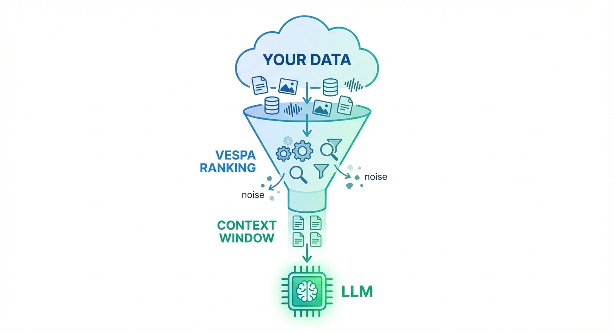

## The Solution: Vespa Out-of-the-Box RAG on Vespa Cloud

Vespa Cloud provides an Out-of-the-Box solution that maximizes the quality of your context window. Unlike simple vector databases that only do nearest-neighbor search, Vespa combines:
1.  **Vector Search** (for semantic understanding)
2.  **Lexical Search / BM25** (for exact keyword matching)
3.  **Advanced Ranking** (BERT, LightGBM, or custom logic to score relevance)

This "Hybrid Search" ensures that the documents sent to the LLM are the absolute best matches for the query, drastically improving the final generated answer.

---

## Step 1: Deploy Vespa RAG Blueprint to Vespa Cloud

First, deploy the pre-configured RAG Blueprint to Vespa Cloud (it's free to start!):

**1.1 Sign up for Vespa Cloud:**
- Go to [Vespa Cloud Console](https://console.vespa-cloud.com/)
- Create a free account ([Free trial available](https://vespa.ai/free-trial/))

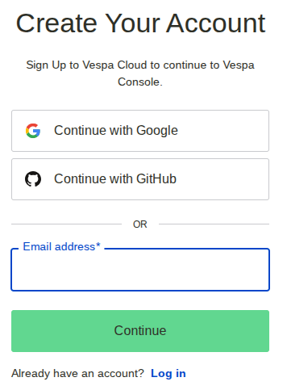

**1.2 Deploy RAG Blueprint:**

- Select "Deploy your first application"
  

- Select "Select a sample application to deploy directly from the browser"
  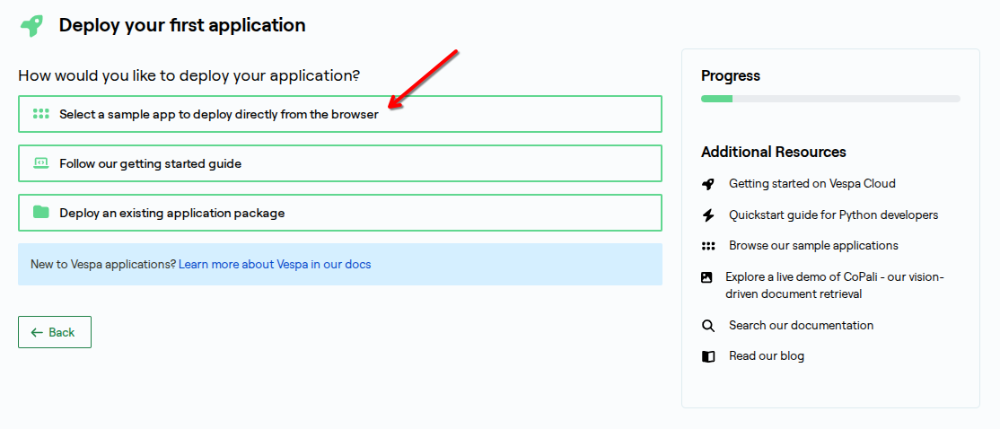

- Select "RAG Blueprint"
  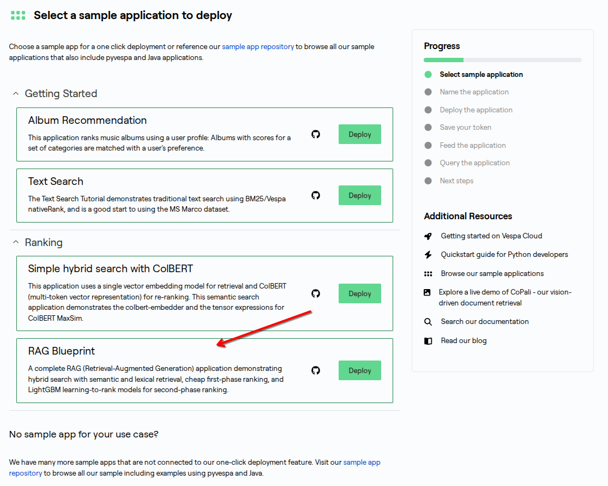

- Click "Deploy"
  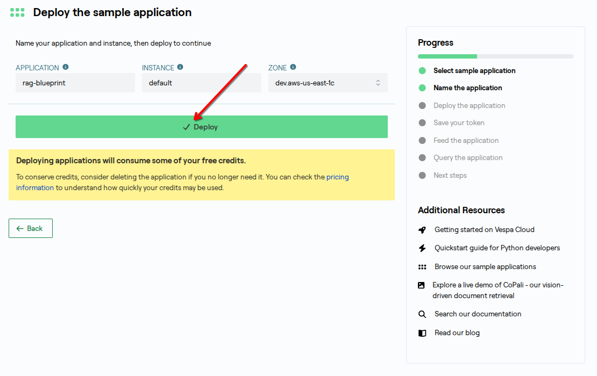
  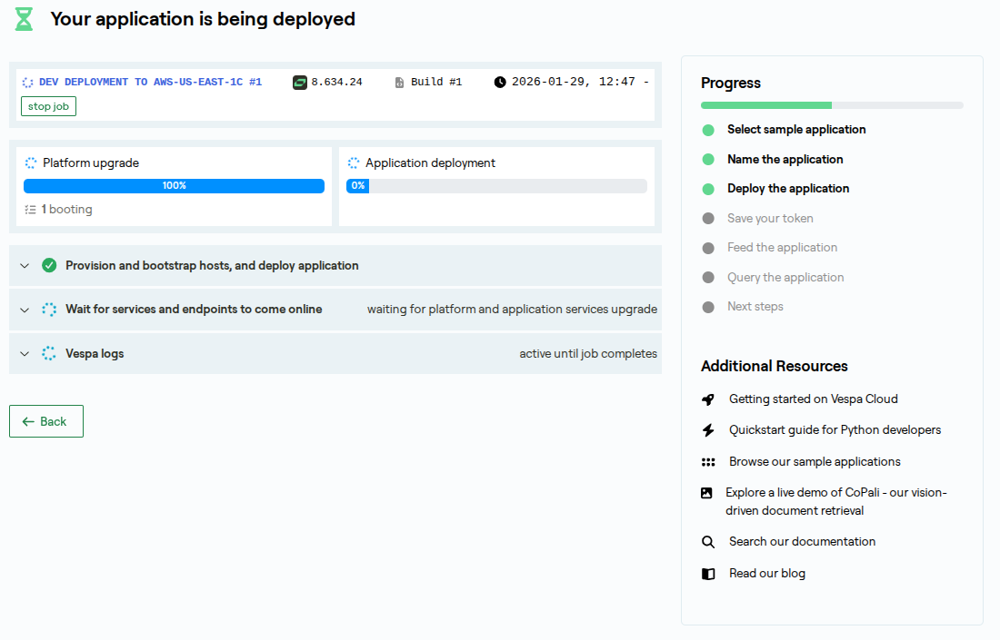

**1.3 Save your credentials:**

- **IMPORTANT:** Save the **token** that appears - you'll need it for authentication!
  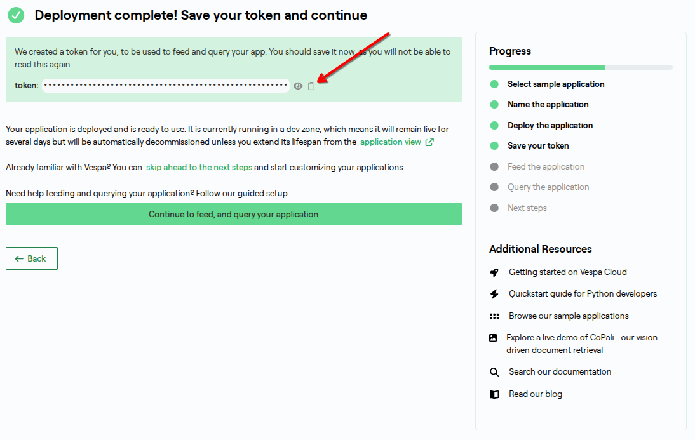

  This token allows secure access to your Vespa deployment. Keep it safe!

- Click "Continue" through the setup
  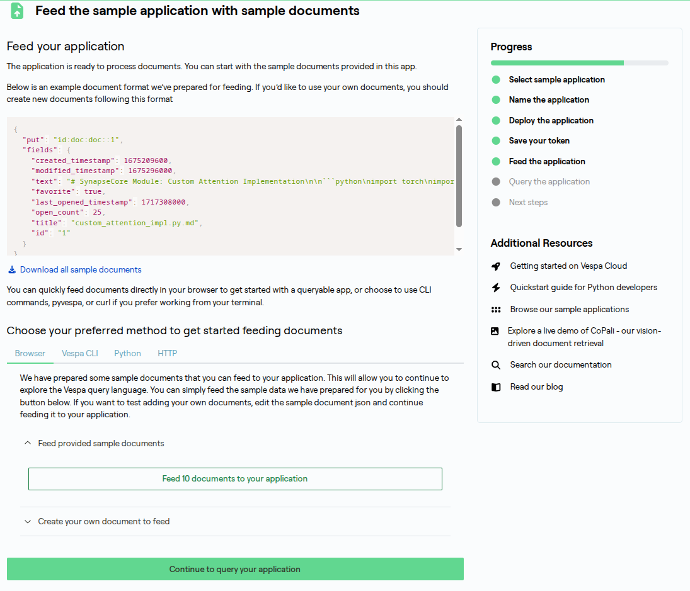
  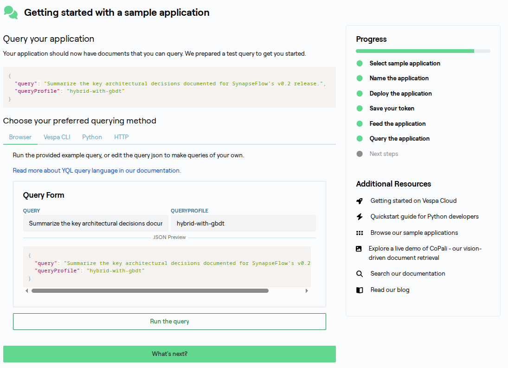

- Go to application view
  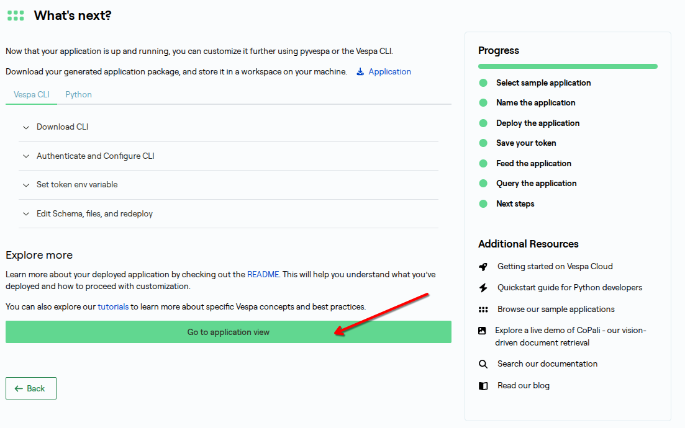
  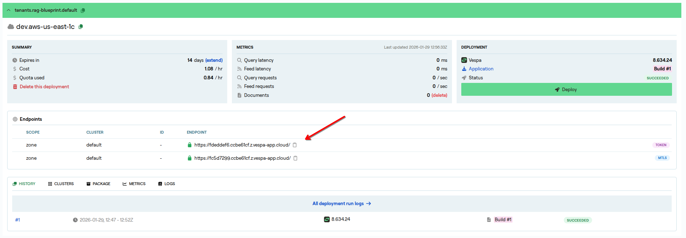
  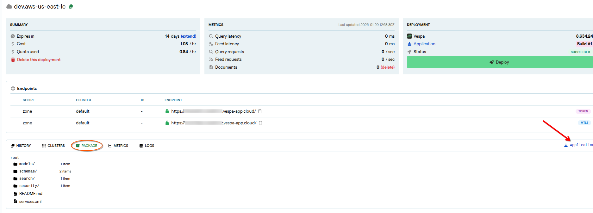

**1.4 Note your endpoint URL:**

Your Vespa endpoint will look like: `https://[app-id].vespa-cloud.com`

You can find it in the application view.

**Save these two values:**
- **Endpoint URL**: `https://[app-id].vespa-cloud.com`
- **Token**: `vespa_cloud_...` (for authentication)

You'll use both in Step 3 to connect NyRAG to Vespa, and optionally for direct querying.

---

## Step 2: Install NyRAG

Now install the NyRAG tool from the vespa-ragblueprint repository:

```bash
# Clone the repository
git clone https://github.com/vespauniversity/vespa-ragblueprint
cd vespa-ragblueprint

# Install uv (Fast, modern Python package manager)
# macOS
brew install uv

# Linux & macOS
# curl -LsSf https://astral.sh/uv/install.sh | sh
# Windows (PowerShell)
# powershell -ExecutionPolicy ByPass -c "irm https://astral.sh/uv/install.ps1 | iex"

# Verify uv installation
uv --version

# Install dependencies using uv
uv sync
source .venv/bin/activate

# Install nyrag locally
uv pip install -e .

# Verify nyrag installation
nyrag --help
```

**What is NyRAG?**
NyRAG is a simple tool that handles:
- Reading your documents (PDFs, DOCX, websites, etc.)
- Chunking text into manageable pieces
- Generating embeddings (converting text to vectors)
- Feeding data to Vespa
- Providing a chat UI with LLM-powered answers

This version is optimized to work with the Vespa RAG Blueprint schema.

**Tip:** The repository includes a `run_nyrag.sh` script that makes it easy to start NyRAG with your Vespa Cloud deployment!

---

## Step 3: Configure Your Project and Process Documents

Now you'll configure your project using the web UI to connect to your Vespa Cloud deployment and set up document processing.

**3.1 Get a free LLM API key:**

Before configuring your project, get a free LLM API key for answer generation.

**Option 1: OpenRouter**
- Sign up at [openrouter.ai](https://openrouter.ai/)
- Access to 100+ models from different providers
- The config will be:
  ```yaml
  llm_config:
    base_url: https://openrouter.ai/api/v1
    model: meta-llama/llama-3.2-3b-instruct:free  # Free model
    api_key: sk-or-v1-...  # Get from openrouter.ai/keys
  ```

**Option 2: OpenAI**
- Sign up at [platform.openai.com](https://platform.openai.com/)
- The config will be:
  ```yaml
  llm_config:
    base_url: https://api.openai.com/v1  # Or omit for default
    model: gpt-4o-mini
    api_key: sk-...  # Get from platform.openai.com/api-keys
  ```

**Recommendation:** Start with **OpenRouter** (easy, free credits, many models). Save your API key - you'll need it in the next step.

---

**3.2 Start the NyRAG UI:**

**Quick way (using the provided script):**
```bash
# This script handles all configuration automatically
./run_nyrag.sh
```

The `run_nyrag.sh` script will:
- Check your Vespa Cloud connection
- Extract the token from your config file
- Set up all environment variables
- Start the NyRAG UI on port 8000


Open http://localhost:8000 in your browser.

**3.3 Configure your project:**

**Step 1: Select and edit the example project**
- In the top header, the project dropdown will show **"doc_example"** (it's pre-selected by default)
- The configuration editor should appear automatically showing "Add Config:" or "Edit Config:"

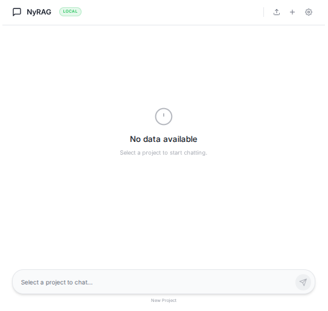
**Description**: Shows the project dropdown menu in the header with "doc_example" option

> **Note:** If the configuration editor doesn't appear (shows chat interface instead), click the **three-dot menu** (⋮) in the top right corner and select **"Edit Config"** to open it manually.

**Step 2: Update your credentials**

The interactive configuration editor will appear. Update these fields with your information:

**Required fields to update:**

```yaml
# Your Vespa Cloud credentials (from Vespa Cloud Console)
cloud_tenant: your-tenant          # Your Vespa Cloud tenant name
vespa_cloud:
  endpoint: https://your-app.vespa-cloud.com  # Your Vespa token endpoint (not mtls)
  token: vespa_cloud_YOUR_TOKEN_HERE          # Your Vespa data plane token

# Your LLM configuration (default: OpenRouter)
llm_config:
  api_key: sk-or-v1-YOUR_KEY_HERE   # Your OpenRouter API key (or other provider)
```

**Notes:**
- The default LLM provider is OpenRouter. If using a different provider, also update `base_url` and `model`.
- `start_loc` defaults to `./dataset` for the included example documents.

**Step 3: Save and start processing**

After updating the configuration:
1. Click **"Save"** or close the editor (changes are saved automatically)
2. Place your documents in the specified directory, or use the existing `./dataset` folder
3. Click **"Start Indexing"** to begin processing

NyRAG will automatically:
1. Read your documents from the specified directory
2. Chunk them into 1024-character segments
3. Generate embeddings for each chunk
4. Feed everything to your Vespa Cloud deployment
5. Show progress in the terminal output panel

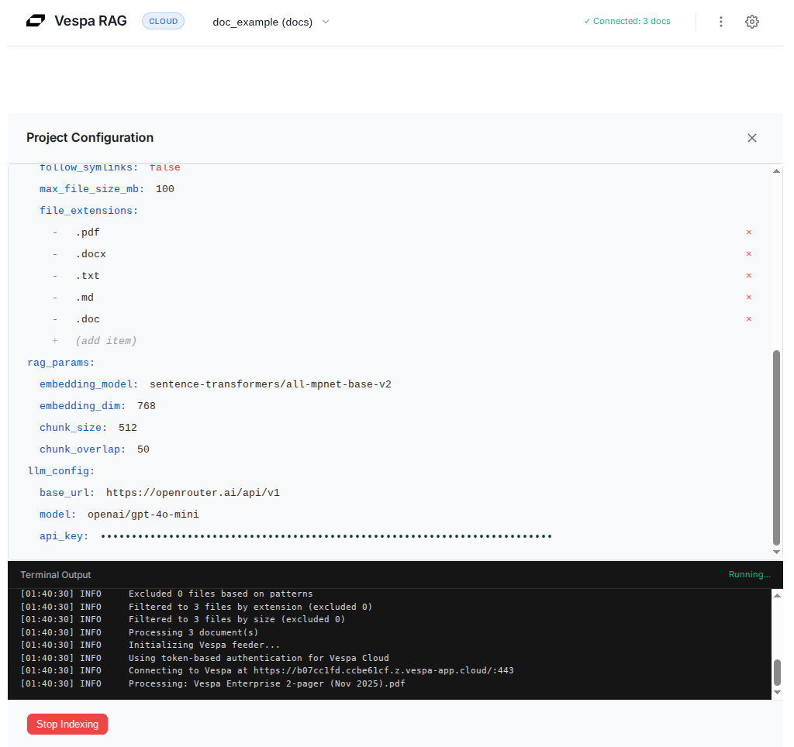
**Description**: Shows documents being processed with terminal logs displaying progress  

---

## Step 4: Chat with Your Data

Once processing is complete, use the NyRAG chat interface to ask questions!


**How it works:**
1. You type a question
2. NyRAG generates multiple search queries
3. Vespa performs hybrid search (BM25 text + vector similarity)
4. NyRAG ranks and selects the most relevant chunks
5. An LLM generates an answer based only on your documents

**Example queries:**
- "What are the main topics in these documents?"
- "Summarize the key findings"
- "Find information about [specific topic]"

**That's it!** You now have a fully functional RAG application.

### Adjusting Search Quality with Ranking Profiles

Want better search results? You can fine-tune how Vespa ranks your documents using the Settings modal (⚙️ icon in the top right).

**Available Ranking Profiles:**

The RAG Blueprint includes 6 different ranking profiles, each optimized for different trade-offs between speed and quality:

1. **base-features** (Default - Fast)
   - Simple ranking using basic BM25 and vector similarity
   - Best for: Everyday queries, development, testing
   - Speed: ⚡⚡⚡ Fast

2. **learned-linear** (Linear Model)
   - Uses logistic regression with learned coefficients
   - Best for: Better quality than base, still fast
   - Speed: ⚡⚡ Medium

3. **second-with-gbdt** (GBDT - Best Quality)
   - Advanced ranking with LightGBM gradient boosting model
   - Best for: Highest quality results, production use
   - Speed: ⚡ Slower but significantly better results

4. **match-only** (No Ranking - Fastest)
   - Returns matches without ranking
   - Best for: Testing retrieval, debugging
   - Speed: ⚡⚡⚡ Fastest

5. **collect-training-data** & **collect-second-phase** (Training)
   - Special profiles for collecting data to train new models
   - Best for: Advanced users building custom ranking models

> **For Advanced Users:** Want to understand the technical details behind these ranking profiles? Learn about phased ranking architecture, LightGBM model integration, tensor operations, and how Vespa scales ranking to billions of documents. See the comprehensive [Ranking Profiles technical guide](https://github.com/vespauniversity/vespa-ragblueprint#ranking-profiles) in the main README, including GitHub folder structure (`vespa_cloud/schemas/doc/*.profile`) and profile inheritance.

**When to use different profiles:**

- **Daily use**: Stick with `base-features` (default) for fast, good-enough results
- **Important queries**: Switch to `second-with-gbdt` when you need the best possible answers
- **Debugging**: Use `match-only` to test if documents are being retrieved correctly

**How to change ranking profiles:**

1. Click the ⚙️ **Settings** icon in the top right corner
2. Select your preferred **Ranking Profile** from the dropdown
3. Click **"Save"**
4. Your next query will use the new profile!

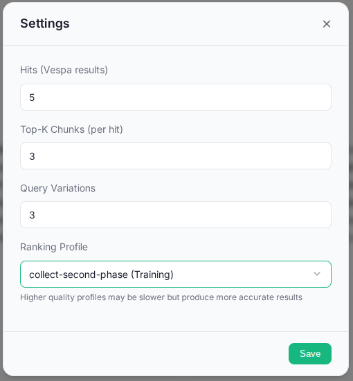
**Description**: Settings modal showing ranking profile selection dropdown with 6 available options

**Pro tip**: The quality difference between `base-features` and `second-with-gbdt` can be dramatic for complex queries. Try both and see which works best for your use case!

---

**Advanced: Querying with Ranking Profiles via CLI**

If you prefer using the Vespa CLI for direct queries (without the NyRAG UI), you can specify the ranking profile:

```bash
# Query with specific ranking profile
vespa query 'query=machine learning' 'ranking=second-with-gbdt'

# Compare results with different profiles
vespa query 'query=RAG architecture' 'ranking=base-features'
vespa query 'query=RAG architecture' 'ranking=second-with-gbdt'
```

See the [Vespa CLI section](#querying-vespa-directly-with-cli-advanced) in "Behind the Scenes" for setup instructions.

---

### Managing Your Data

Need to reset or clean up your data? The advanced menu (three-dot icon ⋮ in the top right) provides data management options:

- **Clear Local Cache**: Removes all cached data files from all projects on your local machine
- **Clear Vespa Data**: Deletes all documents from Vespa for the currently selected project

Both options require confirmation before proceeding. Use these when you want to start fresh or remove old data.

---

## Bonus: Try Web Crawling Mode

Want to create a RAG application from website content instead of local documents? NyRAG supports web crawling!

**How to switch to web crawling mode:**

1. **Open the configuration editor**
   - Select `web_example (web)` on the dropdown list on top
   - Click the **three-dot menu** (⋮) in the top right
   - Select **"Edit Config"**

2. **Update the configuration for web mode**

   In the configuration editor, change the required fields which is similar to the doc_example (doc):

3. **Save and start crawling**
   - Save the configuration
   - Click **"Start Indexing"**

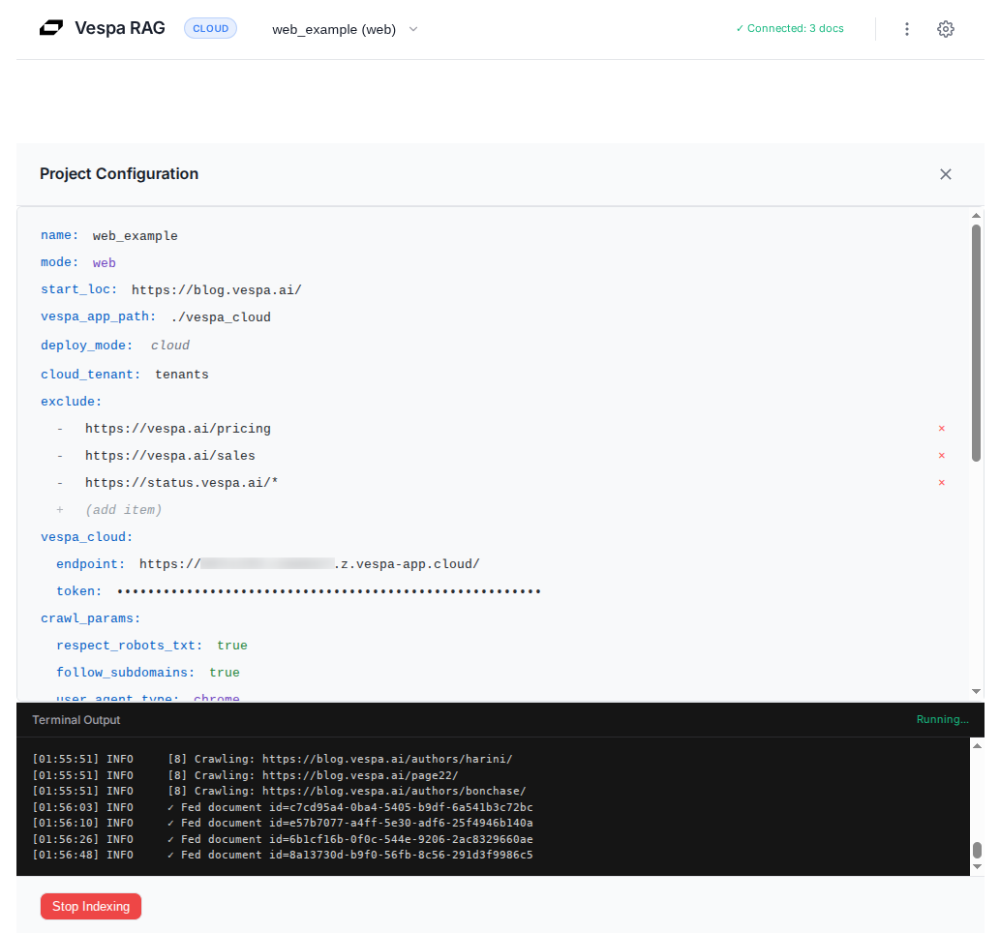 
**Description**: Shows web crawling in progress with terminal logs displaying discovered URLs and processed pages

**Web Mode Features:**
- Automatic link discovery and crawling
- Respects `robots.txt` and crawl delays
- Smart content extraction (removes navigation, ads, boilerplate)
- Deduplication across similar pages
- Resume capability for interrupted crawls

**Example Use Cases:**
- Product documentation sites
- Company knowledge bases
- Blog archives
- Help center articles
- Technical wikis

**Tips:**
- Start with a small section of a website to test before crawling the entire site
- Use `exclude` patterns in the config to skip unwanted pages (e.g., `/pricing`, `/sales/*`)
- Monitor the terminal output panel to track crawling progress


---

<!--
## Alternative: Query with Python or CLI

If you prefer coding over the UI, you can query Vespa directly:

**Using Vespa CLI:**
```bash
# Install Vespa CLI
brew install vespa-cli

# Configure to use your cloud deployment
vespa config set target cloud
vespa config set application your-tenant.your-app

# Authenticate (one-time setup)
vespa auth login

# Or use certificate authentication
vespa auth cert app

# Simple query
vespa query 'query=What is RAG?'

# Query with custom headers (if using token auth)
vespa query \
  --header="Authorization: Bearer your-token-here" \
  'query=What is RAG?'
```

**Using Python (pyvespa):**
```bash
pip install pyvespa
```

```python
from vespa.application import Vespa

# Option 1: Connect with token authentication
app = Vespa(
    url="https://your-app.vespa-cloud.com",
    vespa_cloud_secret_token="your-vespa-cloud-token"  # From Step 1
)

# Option 2: Connect with certificate authentication
# app = Vespa(
#     url="https://your-app.vespa-cloud.com",
#     cert="/path/to/your/certificate.pem"
# )

# Option 3: For local deployment (no auth needed)
# app = Vespa(url="http://localhost:8080")

# Search
response = app.query(
    yql="select * from doc where userQuery()",
    query="What is RAG?",
    hits=5
)

# Print results
for hit in response.hits:
    print(f"Title: {hit['fields']['title']}")
    print(f"Chunks: {hit['fields']['chunks'][:2]}")
    print("---")
```

**Note:** Use the token you saved in Step 1 for authentication. The token allows secure access to your Vespa Cloud deployment.

---
-->

## Troubleshooting

Running into issues? We've got you covered! For detailed troubleshooting guides covering Vespa connection errors, LLM configuration, document processing, and more, see the **[Troubleshooting section](https://github.com/vespauniversity/vespa-ragblueprint#troubleshooting)** in the main README.

**Quick help:**
- **Community support**: Join [Vespa Slack](http://slack.vespa.ai/)
- **Report issues**: [GitHub Issues](https://github.com/vespauniversity/vespa-ragblueprint/issues)
- **Documentation**: [Vespa Docs](https://docs.vespa.ai/)

---

## Behind the Scenes

Want to understand what's happening under the hood? Here are the technical details:

### The Schema

The RAG Blueprint uses a carefully designed schema that defines how your documents are stored and searched:

`vespa_cloud/schemas/doc.sd`:

```java
schema doc {
    document doc {
        field id type string {
            indexing: summary | attribute
        }
        field title type string {
            indexing: index | summary
            index: enable-bm25
        }
        field text type string {
        }

        # Optional metadata fields for tracking document usage
        field created_timestamp type long {
            indexing: attribute | summary
        }
        field modified_timestamp type long {
            indexing: attribute | summary
        }
        field last_opened_timestamp type long {
            indexing: attribute | summary
        }
        field open_count type int {
            indexing: attribute | summary
        }
        field favorite type bool {
            indexing: attribute | summary
        }
    }

    # Binary quantized embeddings for the title (768 floats → 96 int8)
    field title_embedding type tensor<int8>(x[96]) {
        indexing: input title | embed | pack_bits | attribute | index
        attribute {
            distance-metric: hamming
        }
    }

    # Automatically chunks text into 1024-character segments
    field chunks type array<string> {
        indexing: input text | chunk fixed-length 1024 | summary | index
        index: enable-bm25
    }

    # Binary quantized embeddings for each chunk
    field chunk_embeddings type tensor<int8>(chunk{}, x[96]) {
        indexing: input text | chunk fixed-length 1024 | embed | pack_bits | attribute | index
        attribute {
            distance-metric: hamming
        }
    }

    fieldset default {
        fields: title, chunks
    }

    document-summary top_3_chunks {
        from-disk
        summary chunks_top3 {
            source: chunks
            select-elements-by: top_3_chunk_sim_scores
        }
    }
}
```

**What's happening here:**
- Your documents have `title` and `text` fields
- The schema defines fields for **chunks** (array of text segments) and **embeddings** (vector representations)
- Binary quantization (`pack_bits`) reduces storage: 768 floats → 96 int8 values
- Both **BM25 text search** and **vector search** are enabled for hybrid retrieval

### How Data Flows

**In this setup:**
1. **NyRAG** reads your documents and generates embeddings (using sentence-transformers)
2. **NyRAG** chunks text into 1024-character segments
3. **NyRAG** feeds documents with embeddings to Vespa
4. **Vespa** stores everything and performs hybrid search
5. **NyRAG** uses an LLM to generate answers from retrieved chunks

**Note:** While Vespa can generate embeddings and call LLMs directly (via HuggingFace embedder and OpenAI components in `services.xml`), this tutorial uses NyRAG to handle those tasks for simplicity. This NyRAG version is optimized for this workflow.

### Querying Vespa Directly with CLI (Advanced)

While the NyRAG UI provides an easy interface for querying your data, you can also query Vespa directly using the Vespa CLI. This gives you more control and insight into how queries work under the hood.

**Install Vespa CLI:**

```bash
# macOS
brew install vespa-cli

# Linux, macOS, Windows
# Download binary from: https://github.com/vespa-engine/vespa/releases
# Place in your PATH

# Verify installation
vespa version
```

**Configure Vespa CLI for your deployment:**

```bash
# Set target to cloud
vespa config set target cloud

# Set your application (from Step 1)
# Format: <tenant-name>.<application-name>.<instance-name>
# Example: mytenant.rag-blueprint.default
vespa config set application <your-tenant>.<your-app>.<your-instance>

# Authenticate with Vespa Cloud
vespa auth login
```

**Example queries:**

```bash
# Simple text search
vespa query 'yql=select * from doc where userQuery()' \
  'query=what is vespa?' \
  'hits=5'

# Hybrid search (text + vector)
vespa query 'yql=select * from doc where userQuery() or ({targetHits:100}nearestNeighbor(chunk_embeddings,embedding))' \
  'query=machine learning' \
  'hits=5'

# With specific rank profile
vespa query 'yql=select * from doc where userQuery()' \
  'query=RAG architecture' \
  'ranking=hybrid' \
  'hits=10'

# Verbose mode (see full HTTP request/response)
vespa query -v 'query=search query'
```

**Why use Vespa CLI?**
- Direct access to query API without UI layer
- Test different ranking profiles and query parameters
- Debug search behavior
- Integrate with scripts and automation
- Lower latency (no LLM generation)

**Note:** This is optional! The NyRAG UI handles all of this for you, plus adds LLM-powered answer generation. The CLI is useful for debugging, testing, and advanced use cases.

---

## Conclusion

**Congratulations!** You've built a production-ready RAG application in 4 simple steps:

1. Deployed Vespa RAG Blueprint to the cloud
2. Installed the NyRAG tool
3. Processed your documents (PDFs, websites, etc.)
4. Created a chat interface to query your data

**What you built:**
- **Hybrid search**: Combines semantic (vector) and text (BM25) search for better results
- **Automatic processing**: NyRAG handles chunking, embeddings, and feeding to Vespa
- **Scalable backend**: Vespa can handle billions of documents and thousands of queries/second
- **LLM-powered answers**: Get grounded answers from your own documents
- **Easy to use**: Web UI for both data processing and querying

**What makes this powerful:**
- **No hallucinations**: Answers are grounded in your actual documents
- **Always up-to-date**: Process new documents anytime
- **Production-ready**: Built on Vespa, used by companies like Perplexity
- **Cost-efficient**: Binary quantization reduces storage by 10x

**Next Steps:**
*   Get the code: [vespa-ragblueprint on GitHub](https://github.com/vespauniversity/vespa-ragblueprint)
*   NyRAG original code: [NyRAG GitHub](https://github.com/vespaai-playground/NyRAG)
*   Learn more: [RAG Blueprint Tutorial](https://docs.vespa.ai/en/tutorials/rag-blueprint.html)
*   Get help: Join the [Vespa Slack](http://slack.vespa.ai/)
*   Try it now: [Vespa Cloud Free Trial](https://console.vespa-cloud.com/)
